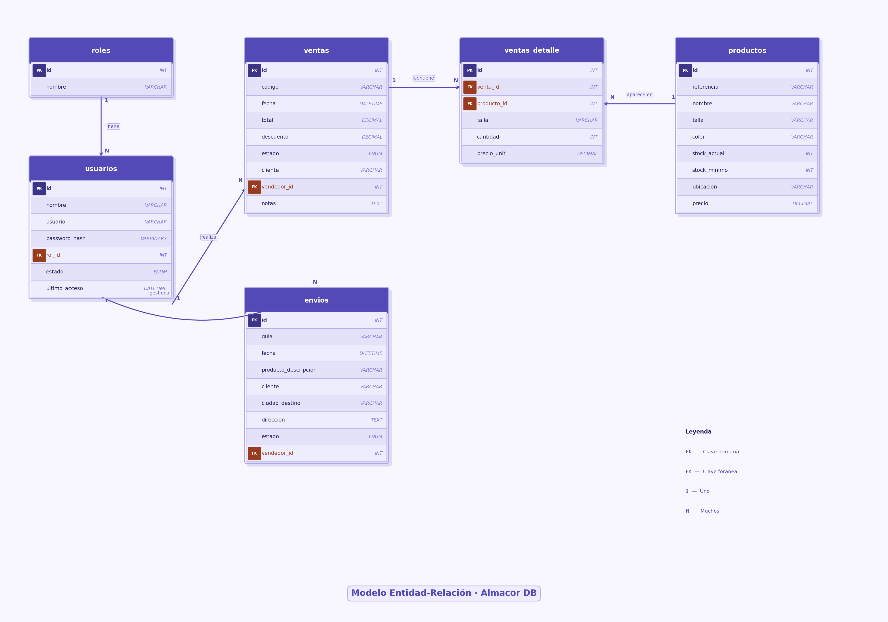

# Sistema Almacor

**Almacor** es un sistema de gestión diseñado para reemplazar procesos manuales basados en cuadernos y hojas de cálculo, permitiendo administrar de forma digital y centralizada la información operativa de un negocio. El software automatiza tareas clave como el control de inventario, el registro de ventas, el seguimiento de envíos y la administración de usuarios, reduciendo errores y mejorando la eficiencia en el manejo de datos. Además, proporciona control de stock en tiempo real y alertas automáticas cuando los productos alcanzan niveles mínimos. En su fase inicial funciona como un sistema independiente, aunque está preparado para integrarse en el futuro con herramientas externas como plataformas de contabilidad o comercio electrónico.

## 🚀 Instalación y Ejecución Rápida
1. Asegúrate de tener **Python 3.8+** instalado.
2. (Opcional pero recomendado) Crea y activa un entorno virtual:
   - **Windows (PowerShell)**:
     - `python -m venv .venv`
     - `.\.venv\Scripts\activate`
3. Instala las dependencias:
   - `pip install -r requirements.txt`
4. Crea la base de datos MySQL ejecutando el script:
   - Importa `backend/schema.sql` en tu servidor MySQL (por ejemplo con `mysql -u root -p < backend/schema.sql`).
5. Configura las variables de entorno de conexión (si no usas los valores por defecto del script):
   - `ALMACOR_DB_HOST` (por defecto `localhost`)
   - `ALMACOR_DB_PORT` (por defecto `3306`)
   - `ALMACOR_DB_USER` (por defecto `almacor_user`)
   - `ALMACOR_DB_PASSWORD` (por defecto `almacor_pass`)
   - `ALMACOR_DB_NAME` (por defecto `almacor_db`)
   
   Alternativa recomendada: crea un archivo `.env` en la raíz del proyecto (está ignorado por Git) con:
   - `ALMACOR_DB_HOST=localhost`
   - `ALMACOR_DB_PORT=3306`
   - `ALMACOR_DB_USER=almacor_user`
   - `ALMACOR_DB_PASSWORD=almacor_pass`
   - `ALMACOR_DB_NAME=almacor_db`
6. Abre una terminal en el directorio del proyecto.
7. Ejecuta: `python main.py`.

Si la base de datos o el backend no están disponibles, la aplicación **no se cerrará**; en su lugar, mostrará un mensaje tipo **“404 — Backend / base de datos no disponible”** en la pantalla de login y en la parte superior de la ventana principal.

## 🛠️ Tecnologías Requeridas
- **Python 3.8+** (lenguaje principal).
- **Tkinter** (incluido en la instalación estándar de Python para interfaces gráficas).
- **CustomTkinter**: interfaz gráfica moderna.
- **MySQL** como base de datos relacional.
- Paquetes Python adicionales (ver `requirements.txt`):
  - `customtkinter`
  - `mysql-connector-python`
  - `bcrypt`


## 📁 Estructura del Proyecto
```
ControldeInventario/
├── .gitignore                  # Configuración para ignorar archivos en Git.
├── main.py                     # Punto de entrada principal de la aplicación. Inicia la ventana principal.
├── README.md                   # Documentación del proyecto (este archivo).
├── requirements.txt            # Dependencias de Python.
├── backend/                    # Lógica de negocio y acceso a datos (MySQL).
│   ├── __init__.py
│   ├── db.py                   # Conexión y pool hacia MySQL.
│   ├── auth.py                 # Autenticación de usuarios y verificación de credenciales.
│   ├── productos.py            # Operaciones sobre productos / inventario.
│   ├── ventas.py               # Operaciones sobre ventas (cabecera y detalle, actualización de stock).
│   ├── envios.py               # Operaciones sobre envíos.
│   ├── usuarios.py             # Operaciones sobre usuarios y roles.
│   └── schema.sql              # Script SQL para crear la base de datos y tablas.
└── frontend/                   # Directorio principal de la interfaz gráfica (GUI).
    ├── components.py           # Componentes reutilizables de la UI (botones, formularios, widgets personalizados).
    ├── main_window.py          # Define la ventana principal de la aplicación.
    ├── theme.py                # Configuración de temas, colores y estilos visuales para la GUI.
    ├── login/                  # Módulo de autenticación.
    │   └── login.py            # Pantalla de login y manejo de sesiones de usuario.
    ├── dashboard/              # Panel de control principal.
    │   └── dashboard.py        # Vista resumen con métricas de inventario, ventas y envíos.
    ├── gestionar_productos/    # Gestión de inventario.
    │   └── productos.py        # CRUD de productos (agregar, editar, eliminar, buscar stock).
    ├── gestionar_usuario/      # Administración de usuarios.
    │   └── usuarios.py         # Gestión de cuentas de usuario (roles, permisos, perfiles).
    ├── ventas/                 # Registro de ventas.
    │   └── ventas.py           # Procesar ventas, actualizar stock y generar reportes.
    └── envios/                 # Gestión logística.
        └── envios.py           # Registrar envíos, tracking y actualizaciones de estado.
```

Cada módulo en `frontend/` es independiente pero integrado en la ventana principal, facilitando el mantenimiento y escalabilidad del sistema.

El frontend se comunica con el backend a través de los módulos de Python del paquete `backend`:
- El **login** valida las credenciales con `backend.auth.login_user`.
- Los módulos de **inventario**, **ventas**, **envíos** y **usuarios** leen y escriben datos en MySQL mediante `backend.productos`, `backend.ventas`, `backend.envios` y `backend.usuarios`.
- El **dashboard** muestra métricas y tablas a partir de consultas en estas mismas capas.

Los roles soportados por defecto son:
- **ADMIN**: acceso completo (gestión de usuarios y productos, ventas, envíos, dashboard).
- **EMPLEADO**: puede consultar inventario y registrar ventas y envíos, pero no administrar usuarios.

## imagenes del frontend


## Modelo Entidad Relacion

## Diccionario de datos
