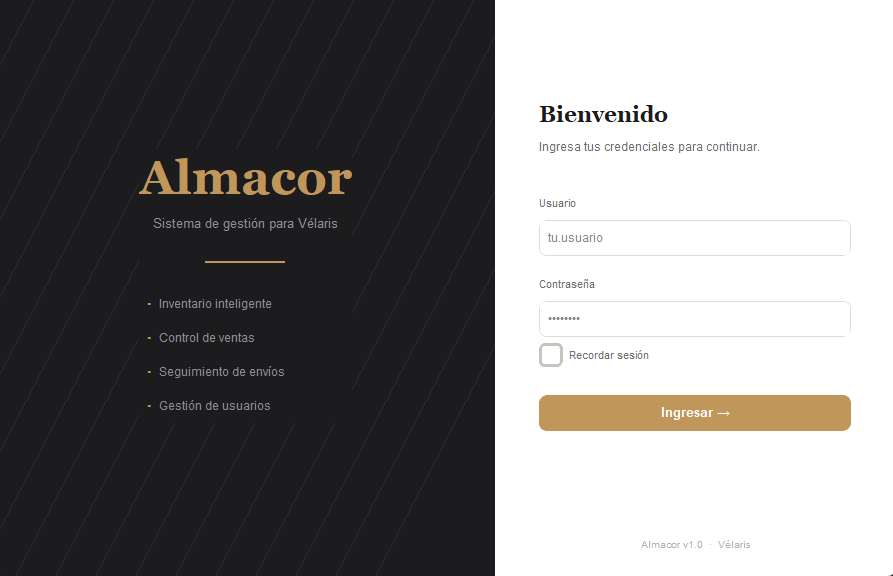
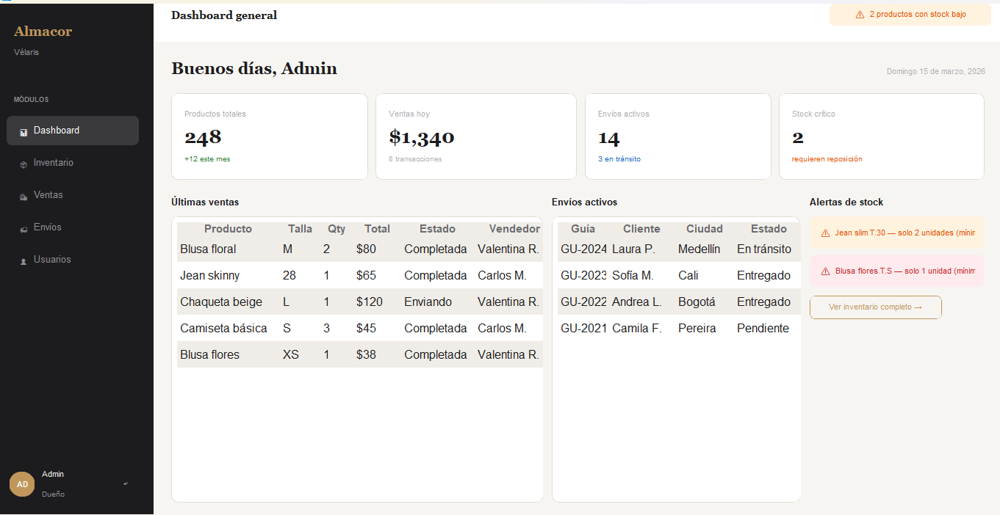
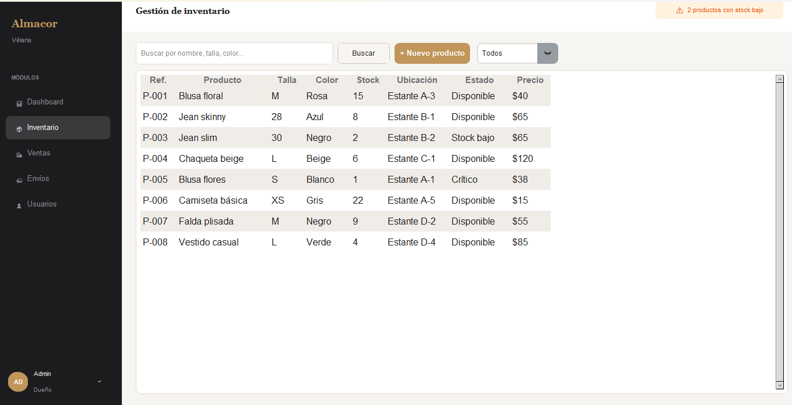
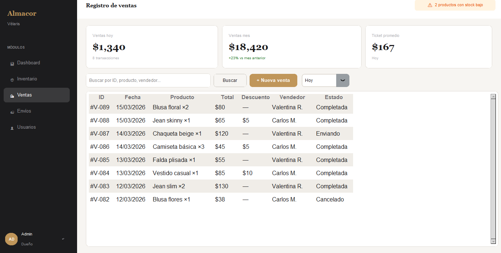
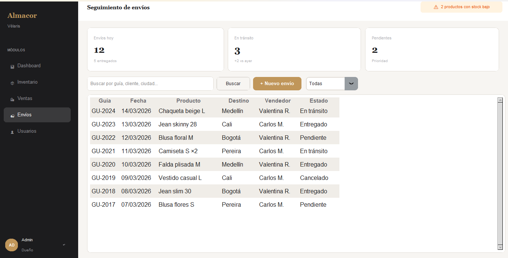
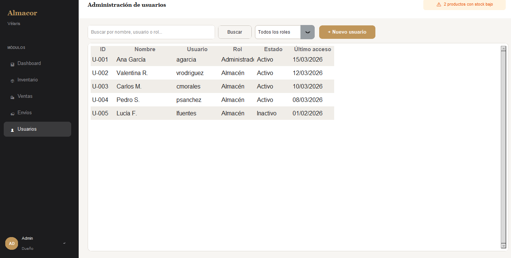

# Sistema Almacor

**Almacor** es un sistema de gestión diseñado para reemplazar procesos manuales basados en cuadernos y hojas de cálculo, permitiendo administrar de forma digital y centralizada la información operativa de un negocio. El software automatiza tareas clave como el control de inventario, el registro de ventas, el seguimiento de envíos y la administración de usuarios, reduciendo errores y mejorando la eficiencia en el manejo de datos. Además, proporciona control de stock en tiempo real y alertas automáticas cuando los productos alcanzan niveles mínimos. En su fase inicial funciona como un sistema independiente, aunque está preparado para integrarse en el futuro con herramientas externas como plataformas de contabilidad o comercio electrónico.

## 🚀 Instalación y Ejecución Rápida
1. Asegúrate de tener **Python 3.8+** instalado.
2. Abre una terminal en el directorio del proyecto.
3. Ejecuta: `python main.py`.

## 🛠️ Tecnologías Requeridas
- **Python 3.8+** (lenguaje principal).
- **Tkinter** (incluido en la instalación estándar de Python para interfaces gráficas).
- **CustomTkinter**: Instala customTkinter (`pip install customtkinter`) para temas y estilos modernos en la GUI.

No se requieren dependencias adicionales complejas; el proyecto usa principalmente librerías estándar de Python.

## 📁 Estructura del Proyecto
```
ControldeInventario/
├── .gitignore                  # Configuración para ignorar archivos en Git (e.g., cachés, entornos virtuales)
├── main.py                     # Punto de entrada principal de la aplicación. Inicia la ventana principal.
├── README.md                   # Documentación del proyecto (este archivo).
└── frontend/                   # Directorio principal de la interfaz gráfica (GUI).
    ├── components.py           # Componentes reutilizables de la UI (botones, formularios, widgets personalizados).
    ├── main_window.py          # Define la ventana principal de la aplicación.
    ├── theme.py                # Configuración de temas, colores y estilos visuales para la GUI.
    ├── login/                  # Módulo de autenticación.
    │   └── login.py            # Pantalla de login y manejo de sesiones de usuario.
    ├── dashboard/              # Panel de control principal.
    │   └── dashboard.py        # Vista resumen con métricas de inventario, ventas y envíos.
    ├── gestionar_productos/    # Gestión de inventario.
    │   └── productos.py        # CRUD de productos (agregar, editar, eliminar, buscar stock).
    ├── gestionar_usuario/      # Administración de usuarios.
    │   └── usuarios.py         # Gestión de cuentas de usuario (roles, permisos, perfiles).
    ├── ventas/                 # Registro de ventas.
    │   └── ventas.py           # Procesar ventas, actualizar stock y generar reportes.
    └── envios/                 # Gestión logística.
        └── envios.py           # Registrar envíos, tracking y actualizaciones de estado.
```

Cada módulo en `frontend/` es independiente pero integrado en la ventana principal, facilitando el mantenimiento y escalabilidad del sistema.

## imagenes del frontend






